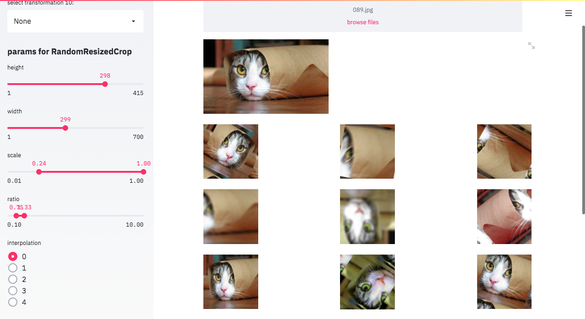
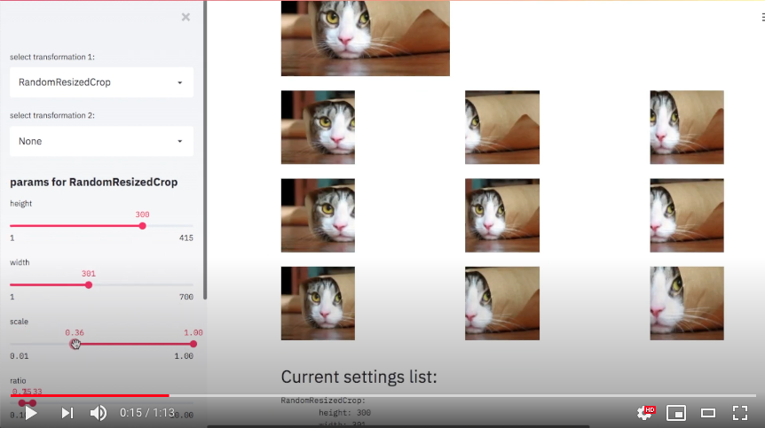

# AugBuilder

A No-code solution to create the **images transformation pipelin**.

- Installed as a pip package.
- Runs in a browser.
- Uses [Albumentations](https://albumentations.ai/) library to apply transformations.
- **Benchmarks** the pipeline.
- Generates a YAML config and a tiny chunk of python code to **integrate with PyTorch** code.



> Powered by [Albumentations](https://albumentations.ai/) and [Streamlit](https://streamlit.io/).

## Installation

You need python 3.6+ and [pip](https://pip.pypa.io/en/stable/installing/) to install the app.

```shell
pip install augbuilder
```

## Usage

### Run the app

Run `augbuilder` from the terminal.

After a few seconds the browser will open the page [localhost:8501](http://localhost:8501).

To stop the application press the `ctrl+c` combination in the terminal.

### Step by step guide

Watch this demo video of usage.

[](https://youtu.be/SVppY2Kobm0)

1. Drop an image to the upload area.
2. Use dropdown on left side to select transformations.
3. Configure transformations below the list of dropdowns.
4. Random results are shown in the main area.
5. To regenerate results click "Refresh images" button.
6. Click "Download config" to get the yaml config and a python integration script.

### How to use ONE-OF

Select oneof in list if you want to add this into you transformation list.
Then you can add different transformations in it.
To close oneof select StopOneOf.
Please, don't select THE SAME transformation, it can caused some errors which will be removed later.

### Pipeline config example

```yaml
RandomResizedCrop:
    height: 299
    width: 299
    scale: (0.24, 1.0)
    ratio: (0.75, 1.3333333333333333)
    interpolation: 0
Flip:
Transpose:
OneOf:
    MotionBlur: {'blur_limit': (3, 53)}
    Blur: {'blur_limit': (3, 22)}
ShiftScaleRotate:
    shift_limit: (-0.06, 0.06)
    scale_limit: (-0.1, 0.1)
    rotate_limit: (-90, 90)
    interpolation: 0
    border_mode: 3
    value: [0, 0, 0]
HueSaturationValue:
    hue_shift_limit: (-20, 20)
    sat_shift_limit: (-30, 30)
    val_shift_limit: (-20, 20)
```
